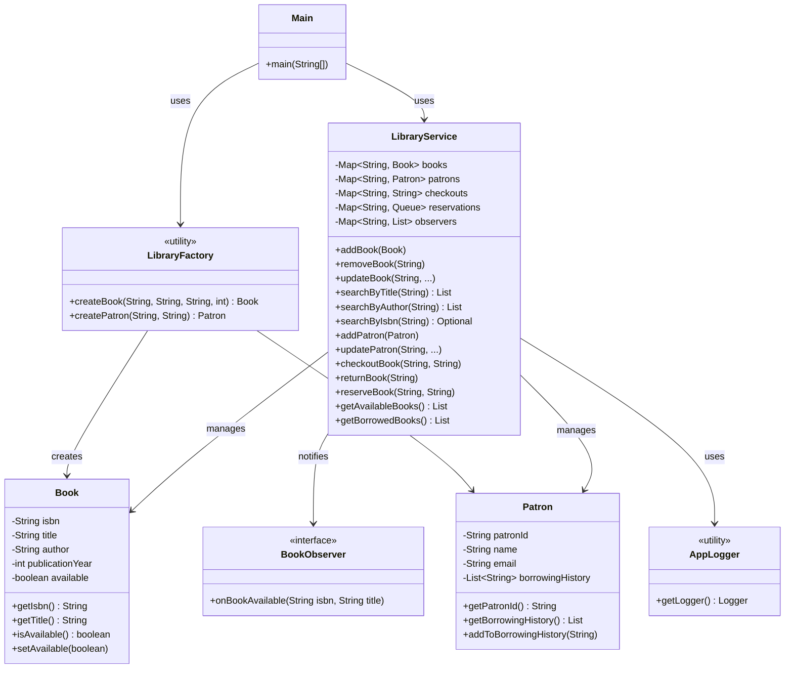

# Library Management System

A simple Java console application demonstrating core OOP principles and design patterns.

---

## Project Structure

```
library/src/main/java/library/
├── Main.java
├── model/
│   ├── Book.java
│   └── Patron.java
├── pattern/
│   ├── BookObserver.java
│   └── LibraryFactory.java
├── service/
│   └── LibraryService.java
└── util/
    └── AppLogger.java
```

---

## How to Run

```bash
# Compile
javac -d out $(find src -name "*.java")

# Run
java -cp out library.Main
```

---

## Features

- **Book Management** – Add, remove, update, and search books by title, author, or ISBN
- **Patron Management** – Add/update patrons and track borrowing history
- **Lending** – Checkout and return books
- **Inventory** – View available and borrowed books
- **Reservation + Notifications** – Reserve checked-out books; get notified on return (Observer pattern)

---

## Design Patterns Used

| Pattern | Where |
|---|---|
| **Factory** | `LibraryFactory` – creates `Book` and `Patron` instances |
| **Observer** | `BookObserver` – notifies patrons when a reserved book becomes available |

---

## Class Diagram



---

## OOP & SOLID Principles

- **Encapsulation** – All fields are private with controlled access via getters/setters
- **Abstraction** – `BookObserver` interface abstracts the notification mechanism
- **Single Responsibility** – Each class has one clear responsibility
- **Open/Closed** – New observer types can be added without modifying `LibraryService`
- **Dependency on abstractions** – `LibraryService` depends on `BookObserver` interface, not a concrete class
